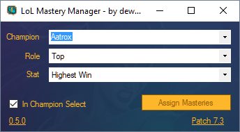

LoL Mastery Manager New Client v0.5
===================

> **NOTICE:** Only work 1280x720 client size.

A tool for managing mastery pages in League of Legends. Inspired by [Championify](https://github.com/dustinblackman/Championify).

[A pretty screenshot.](Example%201%20-%20Menu.gif)

[See it in action! -> Menu](https://raw.githubusercontent.com/dewster/lol-mastery-manager-master-new-client/master/Example%201%20-%20Menu.gif)
[See it in action! -> In Game](https://raw.githubusercontent.com/dewster/lol-mastery-manager-master-new-client/master/Example%201%20-%20In%20Game.gif)

Features
--------
- [x] Download mastery pages from [Champion.gg](http://champion.gg/)
- [x] Automatically assign mastery points based on selected champion and role
- [x] Works in the menus and during champion select

FAQ
---

### Why is it not properly assigning masteries?
Calculating the positioning of the mastery trees is hard to get right for all screen sizes. Only work 1280x720 client size.
### Will I get banned for using this?
Riot Sargonas has stated the following on the matter:

>This one is is in an gray area. It does a lot more interactions for the user than we typically consider ok, though the time and place it does it (masteries page) is a lot less sensitive than, say, in game.
It's not something we can make a snap judgement on at this time without careful consideration, but we're definitely not 100% okay with the idea yet due to the fact it's scripting player actions, even though in the out-of-game client. [[Link]](https://www.reddit.com/r/leagueoflegends/comments/3oeb8q/just_made_a_tool_for_automatically_creating/cvx7hm3)

>We typically don't ban for using a tool like this without an announcement. Further more, usage of these kinds of tools usually result in a warning and a temp ban before a permanent ban being the last step.
I can't give you any kind of update now or anytime in the immediate future, but I can say that you will not wake up to a sudden and un-expected ban without warning by using this tool. [[Link]](https://www.reddit.com/r/leagueoflegends/comments/3oeb8q/just_made_a_tool_for_automatically_creating/cw03o71)

**TL;DR:** Currently, you will not be banned for using it. And if Riot eventually decides that this *is* against the ToS, there would be fair warning before any permanent ban takes place against your account. So for now, happy mastery assigning :wink:

### Can I run it on Mac OS X?
As of right now only Windows is supported, but OS X support is being investigated.

### Big high five to:
[MadScripts] https://github.com/MadScripts - Creat original Mastery Manager v1
[Maxdeviant] https://github.com/maxdeviant/ - Fixed Mastery Manager v1
